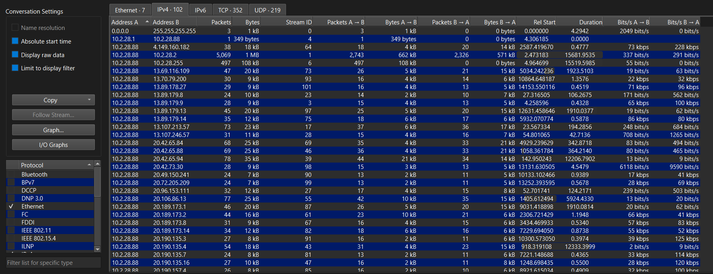
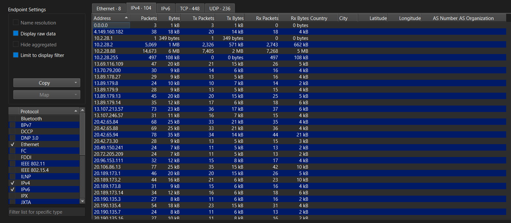
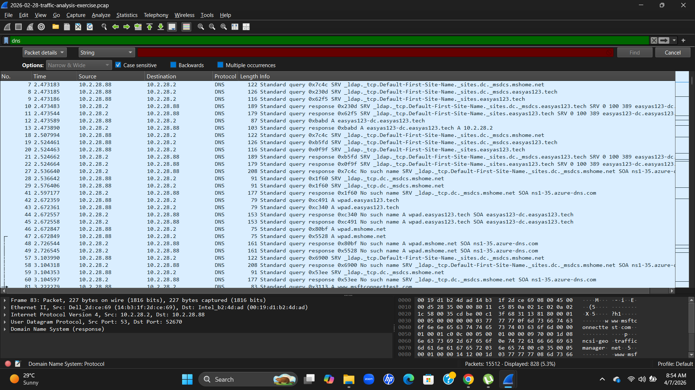
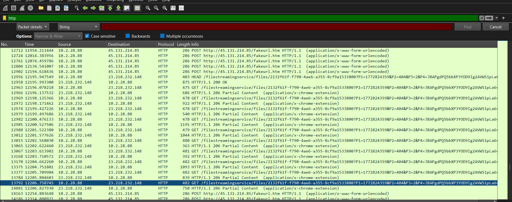
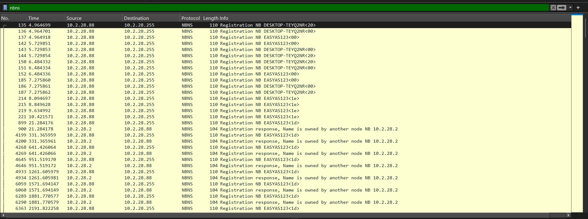
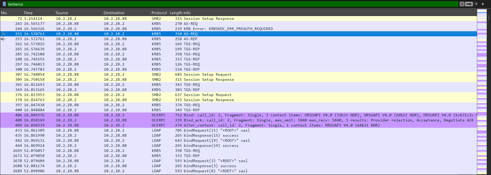
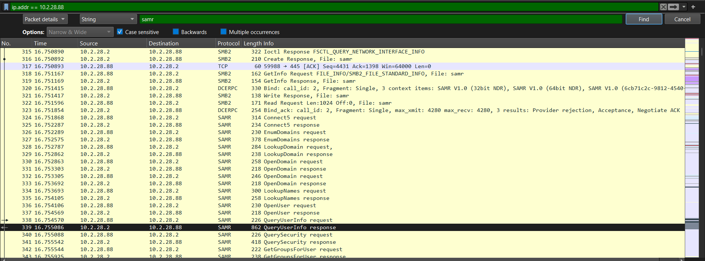
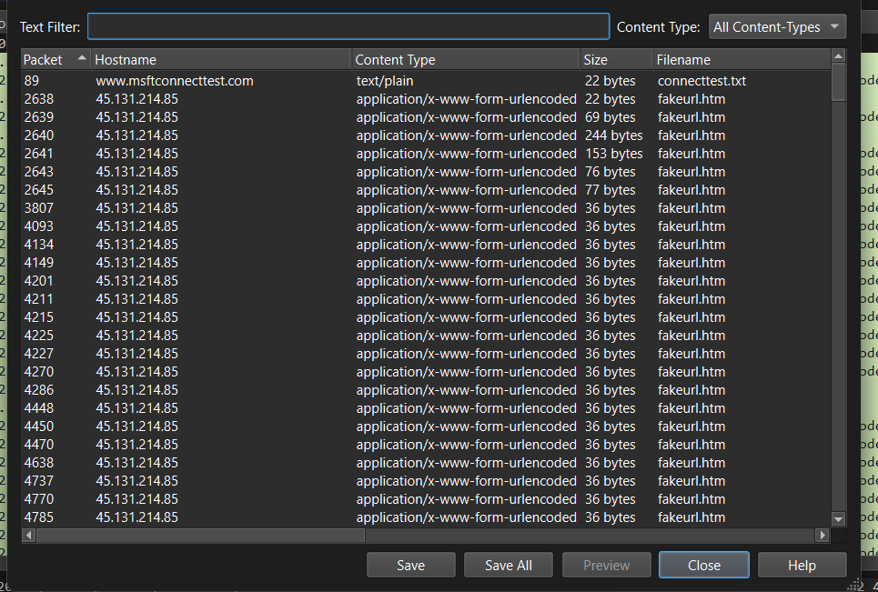

# Network-Intrusion-Investigation-Wireshark 
Wireshark-based network traffic analysis case study identifying suspicious activity, DNS anomalies, and potential data exfiltration
# 🚨 Network Intrusion Investigation using Wireshark

## 🧠 Incident Response Case Study

This project presents a network traffic investigation using Wireshark to identify suspicious activity, abnormal communication patterns, and potential system compromise.

---

## 🎯 Objective

* Identify suspicious hosts in the network
* Analyze communication behavior
* Detect malicious activity
* Investigate potential data exfiltration

---

## 📊 Suspicious Host Identification

* Identified host **10.2.28.88** communicating with multiple IPs
* Long-duration connections and high packet count observed
* Indicates abnormal network behavior

---

## 📈 Endpoint Analysis

* Host **10.2.28.88** shows highest packet and byte count
* Most active system in the network
* Flagged for further investigation

---

## 🌐 DNS Analysis

* Repeated DNS queries detected
* Multiple failed lookups (“No such name”)
* Suggests suspicious or automated domain activity

---

## 🌍 HTTP Traffic Analysis

* Suspicious HTTP POST requests identified
* Communication with external IPs observed
* Possible data exfiltration or malicious downloads

---

## 👤 System & User Identification

* Hostname identified via NBNS

* User authentication observed via Kerberos

* Full user details extracted

---

## 📂 File Extraction

* Extracted HTTP objects from traffic
* Suspicious file **fakeurl.htm** identified

---

## 🚨 Key Findings

* One internal system showed abnormal communication behavior
* Repeated DNS failures indicate possible probing activity
* Suspicious HTTP traffic suggests malicious interaction
* Evidence of file transfer and external communication

---

## 🧠 Threat Assessment

The observed behavior suggests:

* Possible system compromise
* Command & Control (C2) communication
* Potential data exfiltration

---

## 🛡️ Recommendation

* Isolate the affected system immediately
* Conduct deeper forensic analysis
* Monitor outbound network traffic
* Strengthen endpoint and network security

---

## 🛠️ Tools Used

* Wireshark
* Network Traffic Analysis
* Network Protocol Analysis (DNS, HTTP, TCP, SMB)

---

## 🚀 Skills Demonstrated

* Network Analysis
* Threat Detection
* Protocol Analysis (DNS, HTTP, Kerberos, SMB)
* Incident Investigation

## 🔍 Key Findings
- Identified suspicious host communicating with multiple IPs
- Detected abnormal DNS query patterns
- Observed repeated HTTP requests and possible malicious downloads
- Indications of potential data exfiltration behavior

  ## 📌 Conclusion
The investigation revealed abnormal communication patterns and suspicious activity from a host within the network. These behaviors indicate a potential compromise and possible data exfiltration. Immediate isolation and further forensic analysis are recommended.
---

